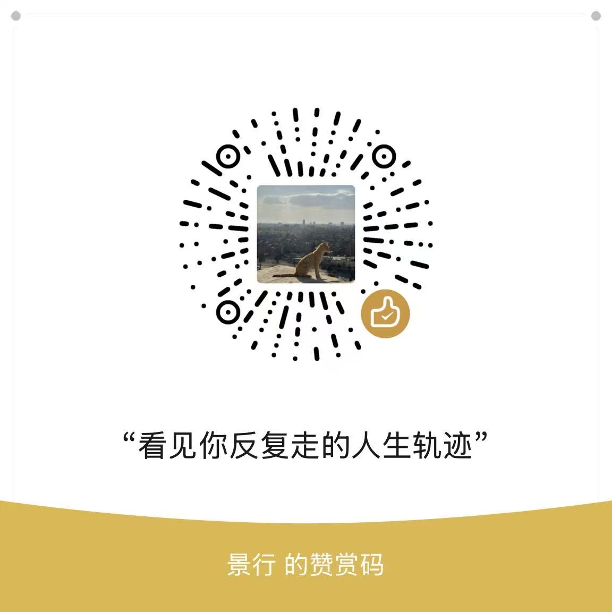

# 人生有迹免费卡片与完整报告 Skill

“人生有迹”免费版会在用户自己的AI运行环境中完成确定性排盘、完整命盘分析、20年趋势计算和PNG制图，不需要验证码，也不会调用人生有迹云端接口。

本仓库同时提供两个免费入口：

- **人生有迹免费卡片**：生成适合保存和分享的3:4人生主线卡片；
- **人生有迹完整报告**：在统一Core母稿上经过五条现实校准，展开性格成长、恋爱伴侣、事业、财务、身体情绪、家庭与逐年阶段。

两者使用同一套确定性排盘和命理Core，不会分别生成互相矛盾的人生主线。

## 这张卡片看什么

### 命局分析

列出完整四柱，保留必要的命理结构，再用普通语言解释能力、矛盾与反复出现的人生主线。不是只看日柱，也不会用“XX型选手”给人贴标签。

### 20年人生行情盘

- **人生K线**：展示过去5年、当前年和未来14年的阶段变化；
- **事业·步步高升**：用空心台阶表示角色、责任、平台与可见成果；
- **财运·元宝积累**：用连续元宝堆表示相对资源积累与留存条件；
- **桃花·关系花期**：只标记关系进入或发展的明显机会年份。

四项趋势都遵循“原局结构 → 大运主题 → 流年执行 → 结果是否留下”的连续逻辑。大运决定阶段主题，流年负责触发和执行；相邻年份会保留伏笔，不机械地一年好、一年坏。

### 当前课题

从工作、财务、感情、家庭、学习、迁移或自我成长中选择一个当前最具体的问题。年龄只用于缩小现实场景，不能直接套用同一句话。

> 图中的K线、事业台阶、元宝和桃花都是阶段性表达，不等于真实职位、金额、对象数量或事件保证。

## 使用方法

安装或添加本 Skill 后，只需发送：

> 请用“人生有迹免费卡片”帮我生成卡片。

AI 会一次询问出生年月日时、出生城市、性别和时间口径；姓名可以不填。成功后返回一张1242×1660 PNG卡片。

### 生成完整报告

请让AI读取本仓库的 `skills/rensheng-youji-growth-map/SKILL.md`，或发送：

> 请使用“人生有迹完整报告”Skill，先询问我的出生资料、现实情况和当前问题，再经过五条事实校准，为我生成完整报告。

完整报告 Skill 同样免费，不需要验证码。五条现实校准会让用户在同一场景下选择三种互斥的具体做法或经历，不再询问宽泛描述是否符合。完成校准并通过出生时间边界预检后，固定交付新版人生卡片、Markdown和10页PDF；PDF第2页直接嵌入同一套Core生成的新版卡片，末页只接受仓库正式微信图片。若跳过校准，只生成明确标注的“初步分析”和新版卡片，不冒充正式完整报告。

报告会把判断落到可以核对的现实层面：性格写日常习惯和处理顺序，事业给出按可能性排序的行业、岗位与任务候选，财务区分主要与第二收入来源，关系区分容易心动、适合长期和高吸引高摩擦的类型，家庭教育说明支持、期待、家庭角色和学习路径候选。证据不足时保留候选范围，不编造唯一经历。

如果用户的AI无法读取GitHub或运行Skill，或者希望获得人工校准、PDF整理和问题解释，可以联系景行代为生成。人工服务收取的是资料整理、校准、运行、排版与解释费用，不是报告解锁费用。

如果当前AI不能安装或运行Skill，也可以直接使用：

> [人生有迹免费网页版](https://rensheng-youji-web.bobbybluemoment.workers.dev)

网页版不需要登录或验证码。

## 运行要求

- Python 3.11 或更高版本；
- 可以读取 Skill 文件并运行本地 Python 的AI客户端；
- 首次运行可由AI自动安装 `requirements.txt` 中的依赖。

仓库已内置中国省、市、县区三级地点数据。中国用户通常只需输入常用地名，不需要填写经纬度或时区；遇到重名地点时再补充省或地级市。

## 内部流程

```text
确定性排盘
  → Core完整分析
  ├→ 免费卡片内容与趋势提取 → 确定性数值映射 → 新版PNG绘图
  └→ 五条现实校准 → 报告提取 → 同一新版卡片 + 固定10页PDF
```

排盘程序负责四柱、大运、流年、地点和真太阳时口径；AI负责在内部规则约束下理解完整命盘；数值脚本负责20年K线、事业、财运和桃花映射；绘图程序只消费校验后的JSON，不重新推命。

## 隐私与免责声明

- 本项目不会把出生资料发送到人生有迹服务器；若通过第三方AI客户端运行，还应同时了解该客户端自身的数据处理规则。
- 本项目属于传统文化体验与自我观察工具，输出不是对个人命运或现实事件的确定判断。
- 人生K线中的阶段指数是算法生成的相对趋势表达，不代表吉凶、财富、健康、婚恋结果或任何事件的发生概率。
- 输出不构成医疗、心理、法律、投资、财务、婚恋或其他专业意见，也不能代替专业人士的诊断与建议。
- 排盘与分析可能受到出生时间、城市信息、历法库、运行环境及算法局限影响；项目不承诺结果绝对准确、完整或适合任何特定用途。
- 中国出生地采用县区或城市中心经度近似；接近时辰边界时，建议用更具体的出生地址复核。
- 用户应自行判断如何理解和使用结果，并对据此作出的现实决定承担责任。

## 使用与转载声明

本仓库公开供个人体验、研究学习和非商业使用，**公开可访问不代表放弃著作权，也不等同于允许任意搬运或商用**。

允许：

- 个人下载、安装、运行、学习，并为个人非商业用途进行私下修改；
- 分享由本人资料生成的卡片，保留卡片中的“人生有迹 by 景行”署名；
- 为向本项目提交贡献而创建GitHub Fork。

未经书面授权，禁止：

- 将本项目或其分析规则、提示词、文案、卡片模板用于收费咨询、付费报告、付费API、会员服务、广告变现产品或其他直接、间接商业用途；
- 对仓库全部或实质性内容进行搬运、镜像、改名、重新打包、二次发布或作为另一款Skill、Agent、网页或应用对外提供；
- 删除或遮盖“人生有迹”、作者署名、版权声明及免责声明后传播；
- 以“官方合作、官方授权、官方分支”等方式误导他人。

完整条款见 [LICENSE](LICENSE) 和 [COMMERCIAL_NOTICE](COMMERCIAL_NOTICE)，第三方地点数据及依赖声明见 [THIRD_PARTY_NOTICES](THIRD_PARTY_NOTICES)。商用或转载授权请通过本仓库的 GitHub Issue 取得书面许可。

> 提醒：赞赏不等于购买服务，也不会自动获得商用、转载或二次发布授权。

## 联系作者

想反馈使用体验、了解后续报告或继续关注“人生有迹”，可以扫码添加作者微信。添加时建议备注“人生有迹”。

<p align="center">
  
</p>

<p align="center"><sub>微信 · 景行</sub></p>

## 赞赏支持

如果这张免费卡片对你有帮助，欢迎自愿赞赏，支持“人生有迹”继续维护与完善。

<p align="center">
  
</p>

<p align="center"><sub>微信赞赏码 · 景行</sub></p>

## 许可

本项目采用“人生有迹有限个人使用许可 1.0”：允许个人非商业使用，禁止未经授权的商业使用、公开镜像、搬运和重新发布。第三方组件仍适用其各自的许可证。

版本：2.2.0

## 维护验收

修改新版趋势算法、输出字段或绘图程序后，运行以下命令，重复检查“视觉信号 → 20年序列 → 卡片组装 → PNG渲染”的确定性链路：

```bash
python -m unittest tests/test_free_card_v2_pipeline.py
python -m unittest tests/test_full_report_pipeline.py
```

测试会使用固定脱敏样例生成临时PNG，并检查1242×1660尺寸、20年连续性、当前年位置、元宝尺度和桃花颜色。AI生成 Core 母稿的步骤仍需通过真实用户端到端调用单独检查。
