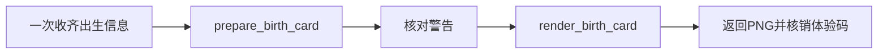

# 人生有迹免费卡片 Skill / MCP

> 输入出生信息，使用一次性体验码生成一张含20年连续人生K线与具体当前课题的3:4 PNG卡片。

[](https://modelcontextprotocol.io/)
[](openapi.yaml)
[](https://rensheng-youji-ap-454189475786.asia-east1.run.app/health)

本仓库是“人生有迹”的公开接入层，只负责告诉AI如何安全收集出生信息、使用个人体验码并调用远程MCP。排盘、分析、卡片内容、字体、素材和PNG渲染均在私有服务端完成，不在公开仓库中分发。

新版卡片固定为“出生配置、初始天赋、核心配置、主线任务、人生K线、当前课题”六段。人生K线展示当前年前5年、当前年及未来14年的连续阶段变化；它不是财富、幸福、健康或事件发生概率。旧版初始坐标插图和人物小传不再展示。

## 一句话体验

把下面整段发给支持读取网页和远程MCP的AI，并把最后的占位内容替换为你收到的个人体验码：

```text
请读取并严格执行这份“人生有迹”接入说明，为我生成免费卡片：https://raw.githubusercontent.com/bobbybluemoment-afk/rensheng-youji-api/main/AI-START.md；我的个人体验码是：这里填写体验码。
```

体验码不要公开发布。连接外部工具时，客户端可能要求用户确认授权。

## 一次性体验码

- 默认签发后7天内有效。
- `prepare_birth_card` 只进入制卡流程，不会永久核销。
- `render_birth_card` 成功返回PNG后，体验码立即失效。
- 服务或渲染失败、没有生成PNG时，可以使用同一个码重试。
- 已成功生成卡片的体验码不能再次生成第二张卡。

## 远程MCP

```text
https://rensheng-youji-ap-454189475786.asia-east1.run.app/mcp/
```

传输方式：`Streamable HTTP`

鉴权方式：

```text
Authorization: Bearer <个人体验码>
```

公开工具：

| 工具 | 用途 |
|---|---|
| `prepare_birth_card` | 校正时间、排出事实并准备人生K线与当前课题 |
| `render_birth_card` | 使用同一组出生信息生成并返回新版1242×1660 PNG |

完整AI执行规则见 [`AI-START.md`](AI-START.md)，通用Skill见 [`SKILL.md`](SKILL.md)，MCP元数据见 [`server.json`](server.json)。

## 推荐调用流程



AI不要自行排盘、重写卡片内容或在本地复刻卡片。输入完整且没有边界警告时，应连续完成准备和出图，避免多余确认与重复调用。

## 时间口径

- 普通钟表时间：`time_basis=local_civil`，服务按出生地点处理时间校正。
- 已经校正的真太阳时：`time_basis=true_solar_adjusted`，服务不重复校正。
- 接近时辰边界、地点不明确或涉及历史夏令时时，以服务警告为准并补充必要信息。

## 客户端不能连接时

GitHub说明不能绕过客户端自身的权限限制。如果AI不能读取外部链接或不支持远程MCP，应明确说明限制，并只指导一次必要的连接器设置；不要要求普通体验者安装Python、下载仓库或打开命令行。

不支持远程MCP但支持OpenAPI的客户端，可读取 [`openapi.yaml`](openapi.yaml)。

## 开发者：本地stdio适配器

普通体验者不需要执行本节。仅在客户端只能运行本地stdio MCP时使用：

```bash
python -m venv .venv
. .venv/bin/activate
pip install -e .
```

设置环境变量：

```bash
export RENSHENG_API_KEY="个人体验码"
export RENSHENG_API_BASE_URL="https://rensheng-youji-ap-454189475786.asia-east1.run.app"
```

运行：

```bash
rensheng-youji-mcp
```

示例见 `examples/`。

## 隐私与边界

- 不要把个人体验码、所有者密钥或真实出生信息提交到公开仓库。
- 体验码只作为本次制卡凭证，不要在回复正文、日志或文件中重复展示。
- 公开仓库不包含卡片算法、固定素材、字体、模板或服务端代码。
- 免费卡片用于文化体验与自我观察，不构成医疗、法律或金融建议。
- MIT License只覆盖本仓库中的公开接口代码与示例，不授权复制“人生有迹”品牌、内容资产、分析方法或卡片模板。
