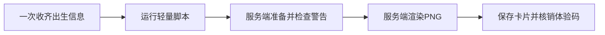

# 人生有迹免费卡片 Skill

> 输入出生信息和一次性体验码，直接生成一张含20年连续人生K线与具体当前课题的3:4 PNG卡片。

[](scripts/generate_card.py)
[](https://modelcontextprotocol.io/)
[](https://rensheng-youji-ap-454189475786.asia-east1.run.app/health)

本仓库是“人生有迹”的公开接入层。默认由AI运行一个不依赖第三方Python包的轻量脚本，直接把出生资料发送给私有服务端并保存PNG；普通用户不需要安装插件、配置MCP或完成OAuth。

排盘、完整命盘分析、20年人生K线、当前课题和PNG渲染均在私有服务端完成。公开仓库不分发核心算法、分析规则、字体、素材或卡片模板。

## 用户怎么使用

安装或启用“人生有迹免费卡片”Skill后，把出生资料和单独收到的一次性体验码发给AI。AI会自行运行 [`scripts/generate_card.py`](scripts/generate_card.py)，用户不需要打开命令行。

可以直接复制：

```text
请使用“人生有迹免费卡片”Skill，根据我的出生资料生成免费卡片。请直接运行Skill自带的轻量REST客户端，不要让我安装插件或配置MCP。我的个人体验码是：这里填写体验码。
```

随后按AI提示提供姓名（可空）、出生年月日时、出生城市和国家或地区、性别，以及时间是否已经过真太阳时校正。

体验码不要公开发布。AI不得在回复、命令行参数、公开文件或日志中重复展示完整体验码。

## 默认流程



脚本使用Python标准库，不需要 `pip install`：

```bash
python3 scripts/generate_card.py \
  --birth "1999-05-27 14:08" \
  --gender female \
  --city "北京" \
  --country "中国" \
  --time-basis local_civil \
  --output "rensheng-youji-card.png"
```

命令只包含非秘密资料。体验码在脚本启动后通过隐藏输入提供；受控运行环境也可安全注入 `RSY_EXPERIENCE_CODE`。

完整AI执行规则见 [`AI-START.md`](AI-START.md)，Skill说明见 [`SKILL.md`](SKILL.md)。

## 一次性体验码

- 默认签发后7天内有效。
- 准备阶段只预占，不永久核销。
- 成功返回并保存PNG后立即失效。
- 服务或渲染失败、没有生成PNG时，可以使用同一个码重试。
- 已成功生成卡片的体验码不能再次生成第二张卡。

## 卡片内容

新版卡片依次展示：出生配置、初始天赋、核心配置、主线任务、人生K线、当前课题。

人生K线展示当前年前5年、当前年及未来14年的连续阶段变化，不表示财富、幸福、健康或某件事情的发生概率。

## 可选兼容入口

远程MCP继续保留给已经完成连接的高级用户：

```text
https://rensheng-youji-ap-454189475786.asia-east1.run.app/mcp/
```

公开工具为 `prepare_birth_card` 和 `render_birth_card`。普通用户不需要为生成免费卡片额外安装或连接MCP。

只能运行本地stdio MCP的开发者可使用 `mcp_server/`；不支持脚本但支持OpenAPI的客户端可读取 [`openapi.yaml`](openapi.yaml)。这些都不是普通体验流程。

## 时间口径

- 普通钟表时间：`time_basis=local_civil`，服务按出生地点处理时间校正。
- 已经校正的真太阳时：`time_basis=true_solar_adjusted`，服务不重复校正。
- 接近时辰边界、地点不明确或涉及历史夏令时时，以服务警告为准。

## 隐私与边界

- 不要把个人体验码、所有者密钥或真实出生信息提交到公开仓库。
- 体验码只作为本次制卡凭证，不在回复正文、命令行参数、日志或文件中展示。
- 免费卡片用于文化体验与自我观察，不构成医疗、法律或金融建议。
- MIT License只覆盖公开接口代码与示例，不授权复制“人生有迹”品牌、内容资产、分析方法或卡片模板。
